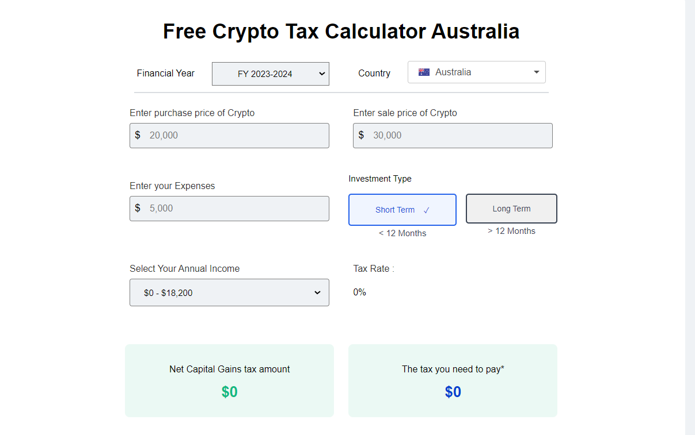
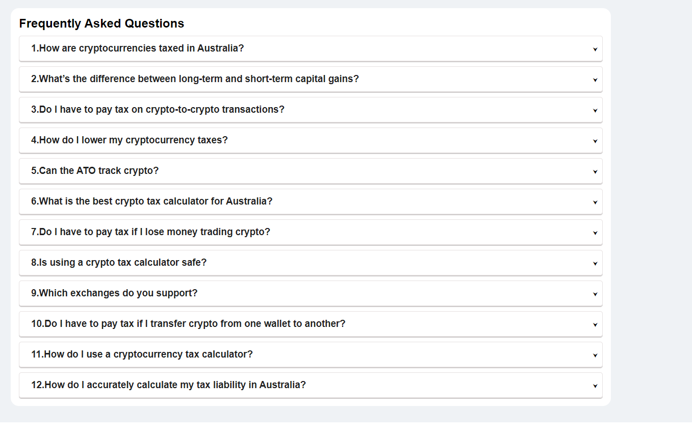
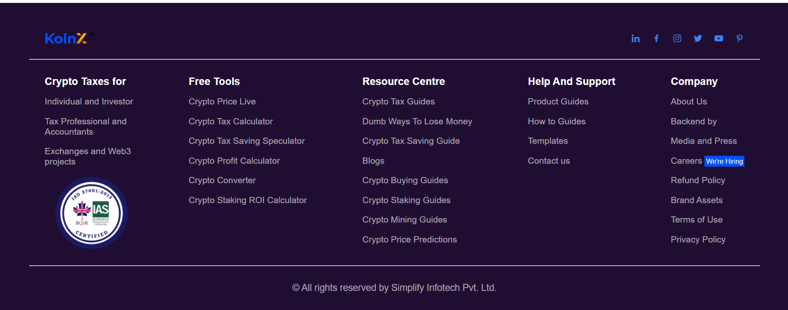

# Free Crypto Tax Calculator for Australia

## Overview

This project is a **Free Crypto Tax Calculator** designed specifically for Australian users. It provides a simple interface for calculating potential tax liabilities on cryptocurrency investments, differentiating between long-term and short-term investments.

**Tech Stack**:
- **Frontend**: React, React-flags-Select, react-icons
- **UI Styling**: CSS and Flexbox for layout and responsiveness

## Live Demo

You can access the live demo of the project here: [FreeCryptoTaxCalculator](https://free-crypto-tax-calculator.vercel.app/)

## ▶️ Demo Video

[Watch the Demo](https://drive.google.com/file/d/1AZ9YR7raHjphgKT1hVFFzsskjkkLnynI/view?usp=sharing)

## Features

1. **Tax Calculator**:
   - Calculates tax on both **short-term** and **long-term** crypto gains.
   - Dynamically adjusts tax based on income brackets, with country-specific rates.

2. **Financial Year and Country Selection**:
   - Users can choose the financial year and country for tax calculations.
   - Flags are provided using the `react-flags-select` package for a seamless experience.

3. **Investment Type Toggle**:
   - Options to select between **short-term** and **long-term** investments with dynamic tax calculations.
   - The discount applied for long-term investments is automatically calculated.

4. **User Assistance with FAQs**:
   - An FAQ section covers common questions, with an expand/collapse feature for clarity.

5. **Subscription Option**:
   - A subscribe section allows users to sign up for the latest crypto news.

6. **Responsive Design**:
   - Fully responsive for optimal usage on desktop and mobile devices.

## Images

### Navbar


### Calculator


### Frequently Asked Questions


### Get Started


### Subscription


### Footer


## How to Use

1. **Set the Financial Year**: Default is FY 2023-2024.
2. **Select the Country**: Only countries with specific crypto tax regulations are included.
3. **Enter Values**: Provide the purchase price, sale price, and any expenses related to the investment.
4. **Choose Investment Type**: Select between short-term or long-term to see how it affects taxes.
5. **View Results**: Taxable income and tax payable are calculated based on inputs.

## Extra Packages

- `react-flags-select`: For country flag selection.
- `react-icons`: For social media icon.
- Other standard packages for React and state management.

## Learning Outcomes

Through this project, I improved my skills in:
- **React State Management**: Using `useState` and `useEffect` hooks to handle user inputs and calculations.
- **Dynamic Data Rendering**: Leveraging conditional rendering to show/hide elements based on state changes.
- **Responsive Design Techniques**: Applying CSS Flexbox and media queries for a seamless user experience across devices.

## Getting Started

Clone this repository and install dependencies:
```bash
git clone https://github.com/SanjayvVarma/Free-Crypto-Tax-Calculator.git
  ```
```bash
cd Crypto-Tax-Calculator
```
  ```bash
npm install
  ```
 ```bash
npm run dev 
  ```


## Future Improvements

Some areas for potential enhancement:
- **Real-Time API Data**: Fetching live exchange rates and tax brackets.
- **Currency Selector**: Adding support for multiple currencies beyond AUD.
- **Expanded Income Brackets**: Allow users to define custom income ranges.